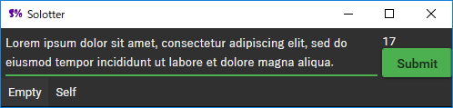

# Solotter
A twitter client for those who want to stay focused on the work.

## Features
- Submit tweets.
- Show your tweets.

That's all.

## Installation
### Set up
- Generate ConsumerKey and ConsumerSecret for you. (For free.)
    - Create your account for [Application Management](https://apps.twitter.com/).
    - Create new application to generate ConsumerKey and ConsumerSecret.
        - Name, description and website are up to you. Callback URL should be empty.
        - Ensure your token has access level "Read and write".
- Set up Solotter.
    - [Download the latest version of Solotter](https://github.com/vain0/VainZero.Solotter/releases/latest).
    - Unzip.
    - Execute `bin/Solotter.exe`.
    - Follow the procedure.
    - Configuration is automatically saved.

### Unintall
- Delete downloaded file.
- Twitter app you created is no longer needed.

## Usage
### Hotkeys
- ``Alt+Delete`` to delete your latest tweet.
- ``Control+Shift+Q`` to logout.
